# databricks_PowerBI
House data were collected using Scrapy from myhome.ge on 12th November 2020, with the intent to create an automated 'fair' price prediction system. The data is split in several pieces. The JSON file represents the 'raw' scraped data, straight from over 50k ad pages. The CSV file, for now, is much smaller and includes only a limited set of data extracted from the JSON file. In this case, we'll merge data from a JSON dataset with an updated CSV dataset to create a fact table and dimension table, ensuring consistency and integrity throughout the process, enabling comprehensive analysis and informed decision-making.

### Data Source : [Tbilisi Housing Challenge 2020](https://www.kaggle.com/datasets/tornikeonoprishvili/tbilisi-housing-challenge-2020)

# Bronze Level
At the Bronze level, I'll refine the schema to accommodate any changes or additions resulting from the merged datasets, and I'll conduct thorough preprocessing to ensure the compatibility and consistency of the data.

**Checking data type and redefining it.**

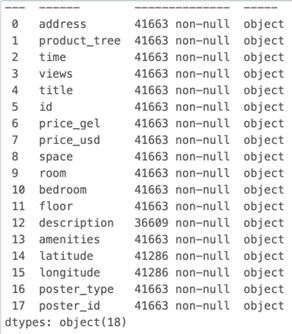 
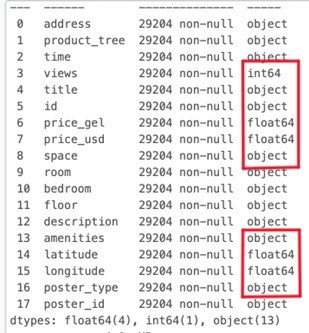

**Converting date column into date format.**

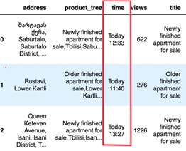 
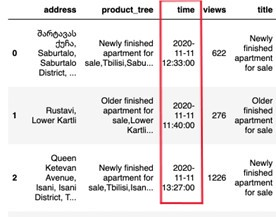

**Checking missing value and filling out**

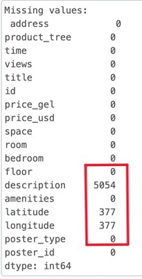 
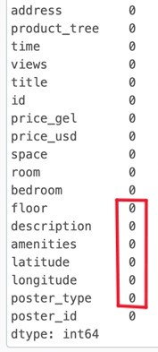

### First Data (JSON)

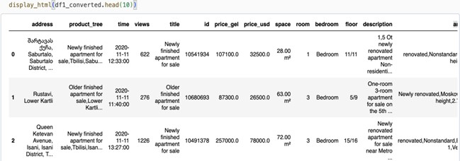

### Second Data (CSV)

**Converting the columns into a list**
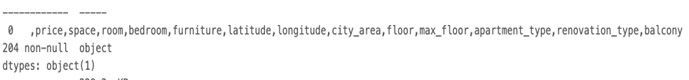

**Checking data type and redefining it.**

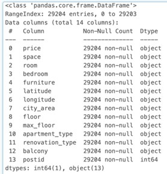
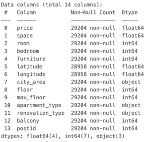

**Checking missing data (No missing value)**

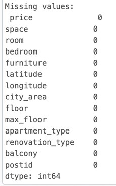

### Second Data (After Preprocessing)

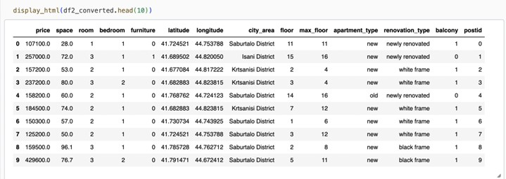


# Silver Level

Once data has been ingested and stored at the bronze level, the next step is to distribute the fact tables and dimension tables

```
RangeIndex: 29204 entries, 0 to 29203
Data columns (total 21 columns):
 #   Column           Non-Null Count  Dtype         
---  ------           --------------  -----         
 0   postid           29204 non-null  int64         
 1   title            29204 non-null  object        
 2   address          29204 non-null  object        
 3   city_area        29204 non-null  object        
 4   time             29204 non-null  datetime64[ns]
 5   views            29204 non-null  int64         
 6   id               29204 non-null  object        
 7   price_usd        29204 non-null  float64       
 8   description      29204 non-null  object        
 9   amenities        29204 non-null  object        
 10  space            29204 non-null  float64       
 11  floor            29204 non-null  int64         
 12  max_floor        29204 non-null  int64         
 13  room             29204 non-null  int64         
 14  bedroom          29204 non-null  int64         
 15  apartment_type   29204 non-null  object        
 16  renovation_type  29204 non-null  object        
 17  furniture        29204 non-null  int64         
 18  balcony          29204 non-null  int64         
 19  poster_type      29204 non-null  object        
 20  poster_id        29204 non-null  object        
dtypes: datetime64[ns](1), float64(2), int64(8), object(10)
```

## Fact table1

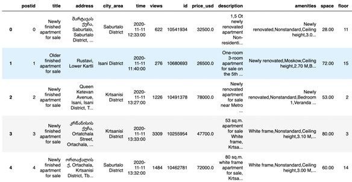

## Dimension table1

```
<class 'pandas.core.frame.DataFrame'>
RangeIndex: 29204 entries, 0 to 29203
Data columns (total 14 columns):
 #   Column           Non-Null Count  Dtype  
---  ------           --------------  -----  
 0   id               29204 non-null  object 
 1   address          29204 non-null  object 
 2   city_area        29204 non-null  object 
 3   price_usd        29204 non-null  float64
 4   space            29204 non-null  float64
 5   floor            29204 non-null  int64  
 6   max_floor        29204 non-null  int64  
 7   room             29204 non-null  int64  
 8   bedroom          29204 non-null  int64  
 9   furniture        29204 non-null  int64  
 10  amenities        29204 non-null  object 
 11  balcony          29204 non-null  int64  
 12  apartment_type   29204 non-null  object 
 13  renovation_type  29204 non-null  object 
dtypes: float64(2), int64(6), object(6)
memory usage: 3.1+ MB
```

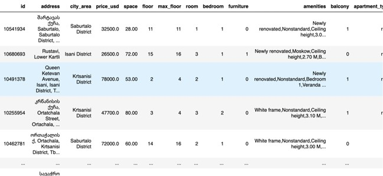


## Dimension table2

```
<class 'pandas.core.frame.DataFrame'>
RangeIndex: 29204 entries, 0 to 29203
Data columns (total 2 columns):
 #   Column       Non-Null Count  Dtype 
---  ------       --------------  ----- 
 0   poster_id    29204 non-null  object
 1   poster_type  29204 non-null  object
dtypes: object(2)
memory usage: 456.4+ KB
```

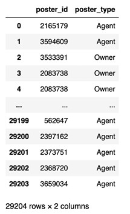

## Fact table2 (house category)

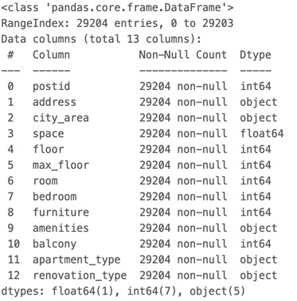

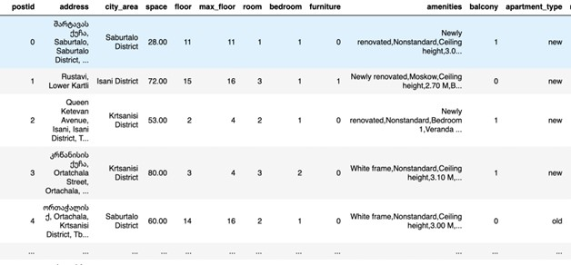

## dimension table (house category)

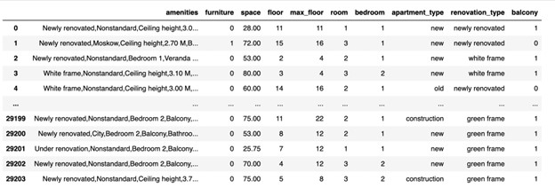

# Gold Level

Finally, we have Gold level data, the most refined, high-quality, and analysis-ready form of data in this engineering process. In this level, we have to create a schema in databricks and save the tables into schema(housing). 


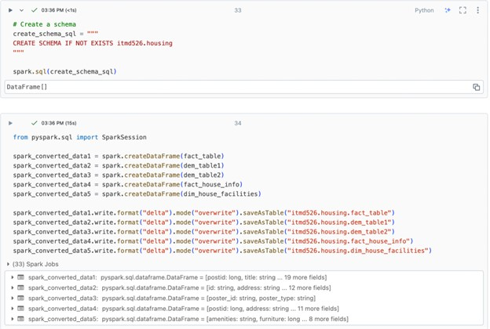

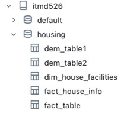


**Last but not least, we can set the connection between powerbi and databricks.** 

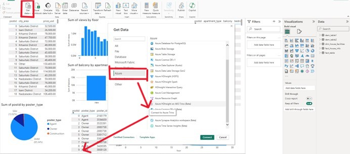
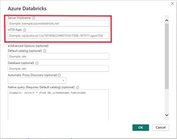


**After connect successfully, we could upload the dataset into powerbi, and start making data visualization**


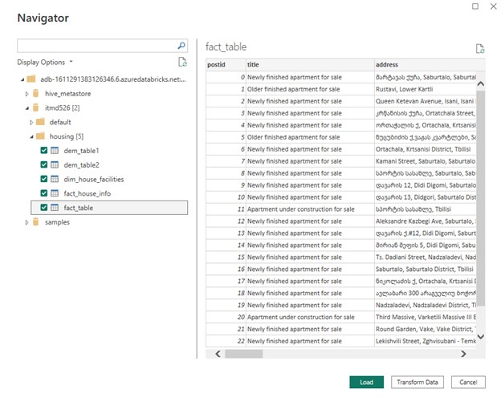

### tables

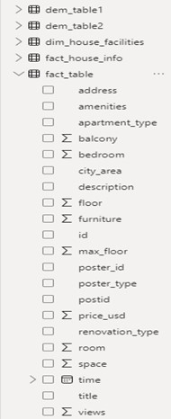

## Data visualization

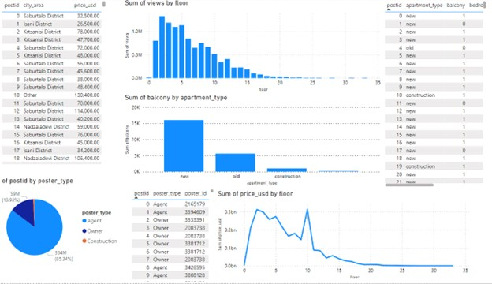